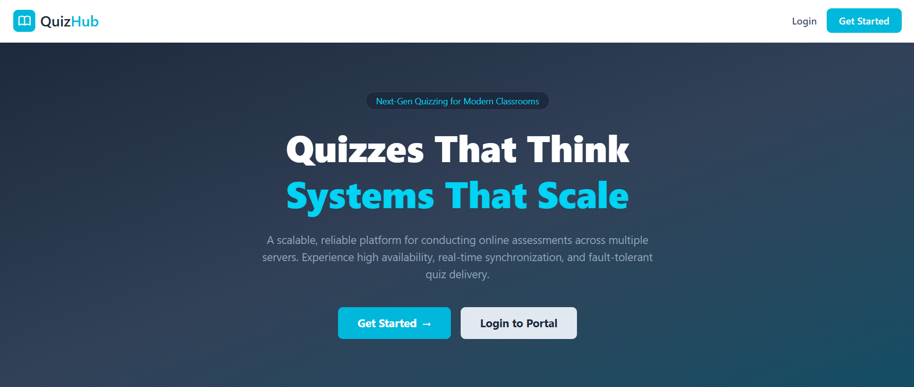
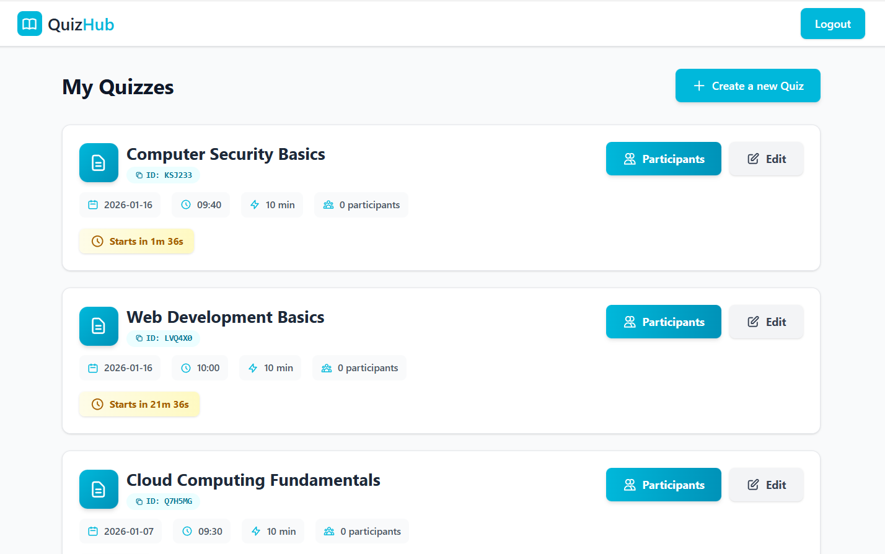
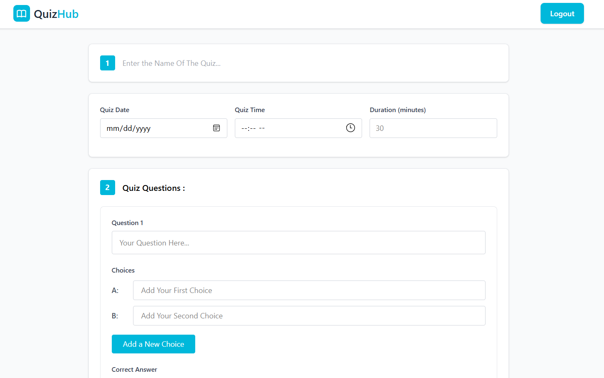
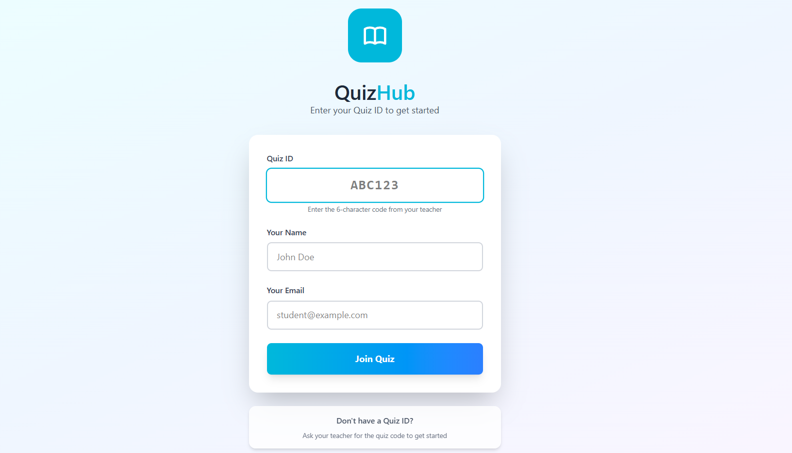
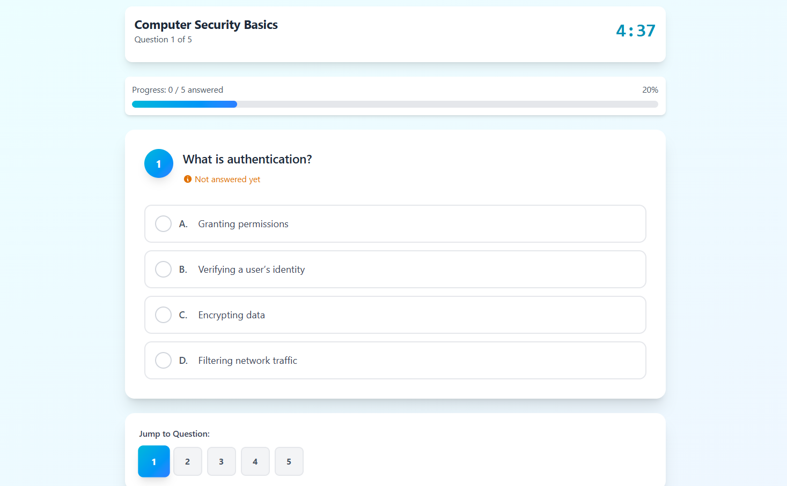
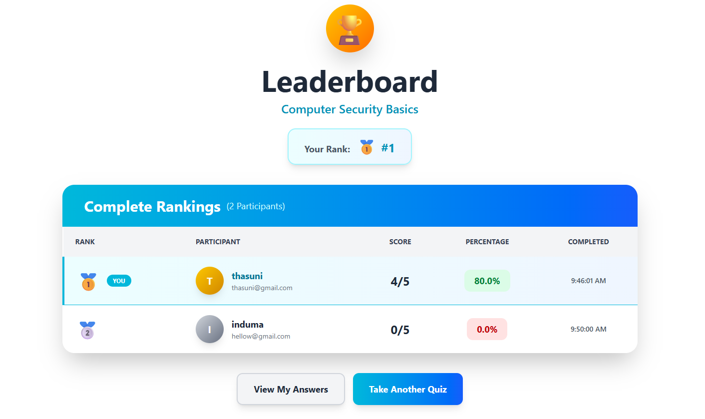
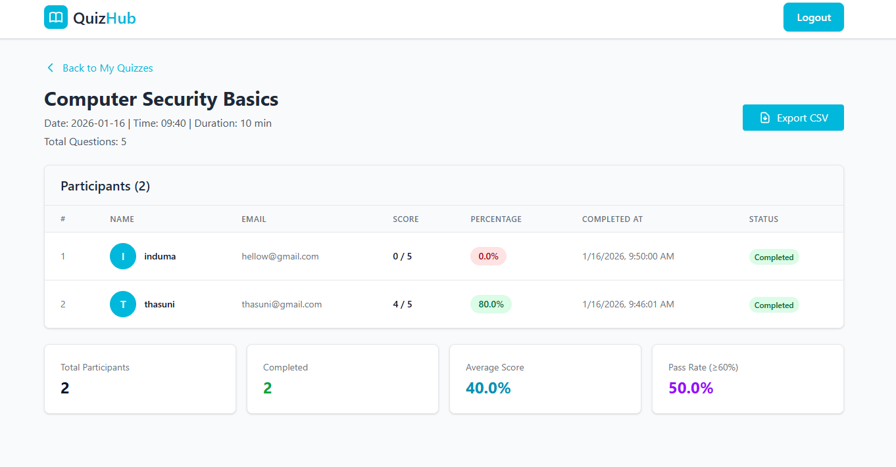

# 🧠 QuizHub – Smart Quizzes, Distributed Intelligence

> **Create, manage, and take quizzes securely with a modern distributed platform.**


---

## 🌟 Overview

**QuizHub** is a **distributed online quiz platform** built with **React.js, Node.js, and MongoDB**.  
It allows teachers to create and manage quizzes, while students can securely join, participate, and track results in real-time.  
Designed as a distributed system, it ensures **scalability, fault tolerance, and secure data handling**.

---

## 🚀 Key Features

- 👩‍🏫 **Teacher Module** – Create, manage, and schedule quizzes  
- 🧠 **Student Interaction** – Join quizzes via ID, secure question delivery  
- 📊 **Quiz Management** – Auto-generated Quiz IDs, duration, and participant tracking  
- 🔒 **Secure Authentication** – JWT-based login and protected routes  
- ⚡ **Fast & Scalable** – Stateless backend + cloud-hosted MongoDB cluster  
- 🎨 **Responsive UI** – Built with React.js and Tailwind CSS  

---

## 🧠 How It Works

1. **Teacher Creates Quiz**  
   - Login securely, create a quiz with questions and answer choices.  

2. **Quiz Scheduling**  
   - Set date, time, and duration for each quiz.  

3. **Student Participation**  
   - Students enter the Quiz ID to join and answer questions securely.  

4. **Result Tracking**  
   - After quiz completion, results are stored in MongoDB for teachers and students.  

5. **Distributed Architecture**  
   - Frontend, backend, and database run as **independent services** communicating over REST APIs.  

---
## 🌐 Distributed System Architecture
<div align="center">

```text
┌────────────────────┐
│   Client Browser   │
└─────────┬──────────┘
          │ HTTPS
┌─────────▼──────────┐
│  React Frontend    │
│  (Web Application) │
└─────────┬──────────┘
          │ REST API
┌─────────▼──────────┐
│ Node.js + Express  │
│ Stateless Backend  │
└─────────┬──────────┘
          │ Mongoose
┌─────────▼──────────┐
│ MongoDB Atlas      │
│ Distributed Cloud  │
│ Database Cluster   │
└────────────────────┘

```
</div> 

---

### Why QuizHub is a Distributed System
- Frontend, backend, and database run as **independent services**
- Communication happens over **network-based REST APIs**
- Backend is **stateless and scalable**
- Database is cloud-hosted with replication support

---


## 🧩 Distributed System Characteristics

| Property | Implementation |
|--------|----------------|
| Distribution | Client / API / DB separated |
| Scalability | Stateless Node.js backend |
| Fault Isolation | Independent services |
| Security | JWT + protected routes |

---
## 💻 Tech Stack

| Category | Technologies |
|-----------|---------------|
| **Frontend** | React.js, Tailwind CSS, Axios, React Router |
| **Backend** | Node.js, Express.js, JWT Authentication |
| **Database** | MongoDB Atlas (cloud-hosted) |
| **Tools** | Vite, Mongoose, Git & GitHub |

---
## 📷 Screenshots
<table>
  <tr>
    <td>
      <figure>
        
        <figcaption>Home Page</figcaption>
      </figure>
    </td>
    <td>
      <figure>
        
        <figcaption>Login</figcaption>
      </figure>
    </td>
    <td>
      <figure>
        
        <figcaption>Create Account</figcaption>
      </figure>
    </td>
  </tr>
  <tr>
    <td>
      <figure>
        
        <figcaption>Teacher Dashboard</figcaption>
      </figure>
    </td>
    <td>
      <figure>
        
        <figcaption>Create Quiz</figcaption>
      </figure>
    </td>
    <td>
      <figure>
        
        <figcaption>Student Join Quiz</figcaption>
      </figure>
    </td>
  </tr>
  <tr>
    <td>
      <figure>
        
        <figcaption>Take Quiz</figcaption>
      </figure>
    </td>
    <td>
      <figure>
        
        <figcaption>Leaderboard</figcaption>
      </figure>
    </td>
    <td>
      <figure>
        
        <figcaption>Participants</figcaption>
      </figure>
    </td>
  </tr>
</table>

---

## ⚙️ Installation & Setup

### 1️⃣ Clone the Repository
```bash
git clone https://github.com/your-username/quizhub.git
cd quizhub
```
### 2️⃣ Backend Setup
```bash
cd backend
npm install
npm run dev
```
Create a .env file:
```bash
MONGO_URI=your_mongodb_connection_string
JWT_SECRET=your_secret_key
PORT=4000
```
### 3️⃣ Frontend Setup
```bash
cd frontend
npm install
npm run dev
```

## 🍀 Thanks for checking out QuizHub! 🚀
# Happy quizzing and learning! 🧠🎉
